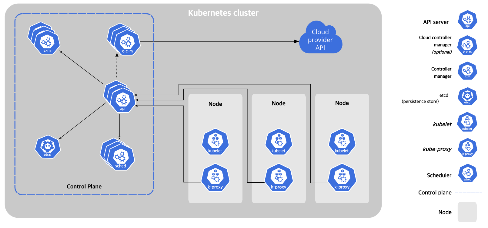

# MLOps

## Before Start

### DevOps


Plan -> Code -> Build -> Test -> Release -> Deploy -> Operate -> Monitor -> Plan ... <br/>

I think.. DevOps's core is the interaction between users and developers. <br/>
This way leads to a successful operation of the software. <br/>
I've seen this approach a lot in industrial engineering. <br/>

### MLOps == ML + DevOps ?

MLOps aims to service ML as a similar to DevOps.<br/>
But, I think MLOps is not just a combination of ML and DevOps. <br/>

Maybe, Diff between MLOps and DevOps comes mostly from ML's data dependence. <br/>
Surely, Data is important to both MLOps and DevOps. <br/>
But I think much more important for MLOps. <br/>

Even if the company that use ML has a very good model's architecture, the performance of the model varies widely depending on whether the datas are well collected or preprocessed. <br/>

<br/>

### CI/CD - Continuous Integration / Continuous Delivery

CI/CD is a method to deliver applications to customers frequently and safely. <br/>
It is a combination of continuous integration and either continuous delivery or continuous deployment. <br/>

#### Continuous Integration

Continuous integration is a software development practice where developers regularly merge their code changes into a central repository, after which automated builds and tests are run. <br/>

#### Continuous Delivery

Continuous delivery is a software development practice where code changes are automatically built, tested, and prepared for a release to production. <br/>

### My Test Environment

#### Hardware
    < Test Server >
        [ NVIDIA DGX Station Version 4.12.0 ]
        OS : Ubuntu 18.04.6 LTS
        CPU : Intel(R) Xeon(R) CPU E5-2698 v4 @ 2.20GHz (40 cores)
        GPU : NVIDIA Tesla V100-DGXS-32GB (4 cards)
        RAM : 256GB
    < Local >
        [ MacBook Pro (15-inch, 2017) ]
        OS : macOS Ventura 13.3
        CPU : Intel(R) Core(TM) i7 @ 2.9GHz (4 cores)
        GPU : Intel(R) HD Graphics 630 (1 card)
        RAM : 16GB


####  Software
    Docker : 20.10.6
    Kubernetes : 
    Python : 3.9.16

<br/><br/><br/>

## Docker - Containerization

#### Build Once, Run Anywhere

Docker is a tool designed to make it easier to create, deploy, and run applications by using containers. <br/>

'Dockerize' is 'Containerize with Docker.' <br/>
It is a way to package software into standardized units for development, shipment and deployment. <br/>

Nowadays, Docker is most popular containerization tool and indispensable for anybody using data. <br/>
So, I think Docker(Dockerize) is the first step for MLOps. <br/>

### Dockerfile

Dockerfile is a text document that contains all the commands a user could call on the command line to assemble an image. <br/>

#### Dockerfile Example - Hello_MLOps

Check [pkgs/container](https://github.com/hwk06023/MLOps/pkgs/container/mlops)

```dockerfile
FROM ubuntu:18.04

RUN apt-get update 

CMD ["echo", "Hello MLOps!"]
```


## Kubernetes - Container Orchestration

check [Official Docs](https://kubernetes.io/docs/home/) <br/>



Kubernetes is an open-source container-orchestration system for automating computer application deployment, scaling, and management. <br/> <br/>

**Pod** <br/>

A pod is the basic building block of Kubernetes. <br/>

A pod encapsulates an application's container (or, in some cases, multiple containers), storage resources, a unique network IP, and options that govern how the container(s) should run. <br/>

**namespace** <br/>

A namespace is a virtual cluster backed by the same physical cluster. <br/>

**Deployment** <br/>

A deployment is a Kubernetes object that allows you to specify the desired state of your application. <br/>

**Service** <br/>

A service is a Kubernetes object that allows you to specify how your application should be exposed. <br/>


### YAML

YAML is a human-readable data-serialization language. <br/>

#### YAML Example - Hello_MLOps

```yaml
apiVersion: v1
kind: Pod
metadata:
  name: hello-mlops
  spec:
    containers:
    - name: hello-mlops
      image: hello-mlops:latest
      ports:
      - containerPort: 80
```

### miniKube

minikube is a tool that lets you run Kubernetes locally. <br/>

download [minikube](https://minikube.sigs.k8s.io/docs/start/) <br/>
download [kubectl](https://kubernetes.io/docs/tasks/tools/) <br/>

#### minikube Example - Hello_MLOps

```bash
$ minikube start --driver=docker # Start minikube
$ minikube status # Check minikube
$ kubectl apply -f hello-mlops.yaml # Generate Pod
$ kubectl get pods # Check Pods ( Current Status )
$ kubectl get pods -A # Check Pods ( All Status )
$ kubectl logs hello-mlops # Check Pod's log
$ kubectl logs hello-mlops -f # Check Pod's log ( Realtime )
$ kubectl logs hello-mlops -c mlflow # Check Pod's log ( mlflow container )
$ kubectl exec -it hello-mlops -- /bin/bash # Connect to Pod
$ kubectl exec -it hello-mlops -c mlflow -- /bin/bash # Connect to Pod ( mlflow container )
$ kubectl delete pod hello-mlops # Delete Pod
$ kubectl delete -f hello-mlops.yaml # Delete Pod
$ minikube stop # Stop minikube
$ minikube delete # Delete minikube
```

#### minikube Example - Hello_MLOps ( with Dockerfile )

```bash
$ docker build -t hello-mlops:latest . # Build Dockerfile
$ kubectl apply -f hello-mlops.yaml # Generate Pod
...
```

-pod
```bash
$ kubectl get pods
NAME          READY   STATUS    RESTARTS   AGE
hello-mlops   1/1     Running   0          2m
```

-namespace
```bash
$ kubectl get namespaces
NAME              STATUS   AGE
default           Active   3m
kube-node-lease   Active   3m
kube-public       Active   3m
kube-system       Active   3m
```

-deployment
```bash
$ kubectl get deployments
NAME          READY   UP-TO-DATE   AVAILABLE   AGE
hello-mlops   1/1     1            1           2m
```

-service
```bash
$ kubectl get services
NAME         TYPE        CLUSTER-IP      EXTERNAL-IP   PORT(S)   AGE
hello-mlops   ClusterIP
```

### PVC - Persistent Volume Claim

A persistent volume claim (PVC) is a request for storage by a user. <br/>

#### PVC Example - Hello_MLOps

```yaml
apiVersion: v1
kind: PersistentVolumeClaim
metadata:
  name: mlflow-pvc
spec: # pvc spec
    accessModes:
        - ReadWriteOnce # ReadWriteOnce, ReadOnlyMany, ReadWriteMany supported
    volumeMode: Filesystem
    resources:
        requests:
            storage: 1Gi # storage size
    storageClassName: standard
```
    
```bash
$ kubectl apply -f mlflow-pvc.yaml # Generate PVC
$ kubectl get pvc # Check PVC
NAME         STATUS   VOLUME                                     CAPACITY   ACCESS MODES   STORAGECLASS   AGE
mlflow-pvc   Bound    pvc-0b0b8b8b-8b8b-0b0b-8b8b-0b0b8b8b0b0b   1Gi        RWO            standard       2m
```

<br/><br/><br/>

## MLflow - ML Lifecycle Management
